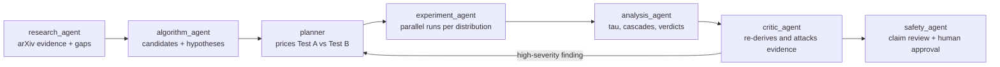

# Bin-Packing Discovery Lab

**An agentic AI lab, orchestrated with Omnigent, that asks when cheap small-instance screening can be trusted while evolving online bin-packing heuristics.**

Built for the Hack-Nation x Databricks *Agentic Scientific Discovery* challenge (Challenge 03).

## The question

When an AI system evolves online bin-packing heuristics, how reliably do rankings on small, cheap instances predict rankings at full scale? Can that reliability be used to prune candidates and cut full-scale evaluations without losing quality?

Full-scale evaluation is the bottleneck in LLM-driven heuristic search. If small instances ranked candidates well, a search could discard most candidates cheaply. The lab tests whether that is safe, against a **pre-registered** bar.

## What the lab found

| | Result |
|---|---|
| **Screening reliability** | The pre-registered bar (tau_small >= 0.70, tau_medium >= 0.80, top-1 retention >= 0.90) was **not met** in any run. tau_small ranged from 0.367 to 0.682. Weibull and uniform are borderline, bimodal is poor. |
| **Larger cheap instances help** | Uniform tau_small rose from 0.611 (50 items) to 0.682 (150 items), still below 0.70. Untested on other distributions. |
| **Pruning** | No validated speedup. Modelled in-sample cascade speedups did not hold up out of sample, so **the lab recommends not pruning on 50-item screening**. |
| **Policy quality** | Candidates C2 and C6 improved over first-fit and best-fit on held-out seeds for weibull, bimodal and uniform-150. Gains are small (0.003 to 0.016 excess) and apply to the stated distributions only. |
| **Compute saved by the lab's design** | One instrumented pass scores every candidate at every fidelity, so any cascade can be replayed from stored scores. Running the nine swept cascades live would cost 2.42x more cost units (2.88x on the 150-item run). |

A negative result is a valid finding here. The lab separates *policy quality* (C2 and C6 look strong) from *screening quality* (not reliable enough to prune on).

## How it works



A **lab director** moderates the loop. It has no science tools, passes IDs between agents (run_ids, critique_ids), and writes every handoff and decision to a shared research record (`results/research_log.jsonl`).

| Agent | Decision it owns | Tools |
|---|---|---|
| `research_agent` | What is already known and what is missing | arXiv search |
| `algorithm_agent` | Which new heuristics deserve testing | candidate registry (verify, register) |
| `planner` | Which test, on which distributions, at what cost | `plan_tests`, `plan_next` |
| `experiment_agent` | Executing a spec within budget | `run_instrumented`, `run_heldout` |
| `analysis_agent` | What the evidence supports | `analyze_runs` |
| `critic_agent` | Which claims the evidence does not support | `critique_runs` |
| `safety_agent` | Whether claims overreach; requires human approval | `read_log` |

**The pivot rule.** If analysis raises flags or the critic reports a high-severity finding, the director reopens the screening assumption. The planner reads the critique and returns follow-up specs, for example larger small instances on the same seeds so the comparison is like for like. In this campaign that triggered a rerun of uniform at 150 items.

### Experiment design

- **Heuristic interface:** `priority(item, bins)` scores the open bins that fit; the highest score wins. Validity is checked on every packing.
- **Metric:** mean excess bins over the lower bound.
- **Pool:** 12 baselines (first-fit, best-fit, worst-fit and 9 variants) plus agent-written candidates, 19 in total here.
- **Fidelity ladder:** small (4 instances of `small_items` items), medium (4 instances of `max(200, 2 x small_items)` items), full (6 instances of 1,000 items).
- **Cost:** items processed ("cost units"). Budget: 4,000,000.
- **Test A (instrumented):** every candidate at every fidelity; measures tau; cascades are replayed from stored scores.
- **Test B (live cascade):** prune stage by stage. It cannot measure tau and has no live tool, so the planner chose Test A.
- **Held-out check:** top candidates plus first-fit and best-fit rescored on seeds 10000 to 10009, never used in search.
- **Campaigns:** one loop with one budget. `python -m lab.campaign new` archives old runs and starts a fresh budget.

## Results

All numbers come from the stored run records in `lab_data/runs/` and are reproduced by `lab.analysis_tools.analyze_runs`.

**Screening quality** (pre-registered: tau_small >= 0.70, tau_medium >= 0.80)

| Run | Small items | Seeds | tau_small [95% CI] | tau_medium [95% CI] |
|---|---|---|---|---|
| `weibull-s50-cb8d26` | 50 | 5 | 0.649 [0.552, 0.746] | 0.805 [0.760, 0.856] |
| `uniform-s50-94481f` | 50 | 5 | 0.611 [0.539, 0.673] | 0.789 [0.697, 0.866] |
| `bimodal-s50-5cbf15` | 50 | 5 | 0.367 [0.237, 0.472] | 0.620 [0.573, 0.673] |
| `uniform-s150-f3eede` | 150 | 7 | 0.682 [0.640, 0.728] | 0.849 [0.816, 0.878] |

tau_small is below 0.70 on every run (the weibull and uniform-150 intervals include 0.70), so the screening hypothesis is reported as *threshold not met, not testable as designed*, not as refuted.

**Held-out policy gains over best-fit** (seeds 10000 to 10009; negative means fewer excess bins)

| Run | C6 | C2 |
|---|---|---|
| weibull | -0.0083 [-0.0091, -0.0074] | -0.0031 [-0.0037, -0.0025] |
| uniform, 150 items | -0.0045 [-0.0055, -0.0034] | -0.0042 [-0.0048, -0.0036] |
| bimodal, 50 items | -0.0160 [-0.0168, -0.0152] | -0.0102 [-0.0111, -0.0092] |

An improvement means "better than the named baselines on the stated distributions", not a new general algorithm.

## Controls and responsible use

- Agent-written hypotheses and candidates are labelled `AGENT-GENERATED` throughout.
- Thresholds are pre-registered by the planner's tool and never change after seeing data.
- Candidate code is AST-checked (no imports, no `while`, no file access) and verified to produce valid packings.
- Numbers come only from tool calls tied to a run_id. Literature claims cite only arXiv ids the research agent retrieved.
- The safety agent reviews claims before they are called conclusions and asks the human for approval. Shell and OS tools require approval, and a USD cost policy caps agent spend.

## Limitations

- Speedups are **modelled cost-unit ratios, not wall-clock**, and recommended cascades were chosen in-sample.
- Out-of-sample cascade retention was below the 0.90 bar and often near the random-pruning rate. Bimodal is the only run clearly above chance, and it is confounded by biased screening and duplicate candidates.
- Some candidates duplicate baselines or each other (the critic found C3 and C4 behave like baselines), so the matching hypothesis verdicts are not independent evidence.
- No discrete or heavy-tailed runs exist, so H1, H2 and H5 are untestable.
- The held-out seeds have now been seen. Effects are small.
- Agent overhead (planner, analysis, critic) is not counted in the cost units.
- The literature search found no work on small-instance proxy fitness for LLM heuristic search. This may be a real gap or a terminology mismatch, since the search did not query multi-fidelity methods. FunSearch was not retrieved.

## Next experiment (proposal, not run)

Fresh-seed uniform at 150 small items, at least 5 seeds, about 741,000 cost units. Seeds must avoid 0 to 6 and 10000 to 10009. The 0.70 threshold and cascade parameters are pre-registered first, and candidates that duplicate baselines are replaced with behaviourally distinct ones. Discrete and heavy-tailed runs follow as a separate step, and wall-clock timing is added.

## Path toward 10x

The bottleneck attacked is full-scale evaluation cost. Pruning could approach large multipliers only if cheap rankings become reliable. The evidence points to three steps: larger cheap instances, more behaviourally distinct candidates, and fresh-seed validation, in that order.

## Run it

Requires Python 3 with `numpy`, and [Omnigent](https://github.com/) (open source, or managed on Databricks).

```bash
pip install numpy
# run from the repo root so `lab` is importable
omnigent run bin_packing_lab.yaml -p "Run the full discovery loop on weibull, uniform and bimodal."
```

Open the session in the Omnigent web UI to watch the sub-agents.

Troubleshooting:
- `ModuleNotFoundError: numpy`: Omnigent was installed in its own environment. Run `uv tool install --reinstall omnigent --with numpy`.
- `No module named lab`: set `PYTHONPATH` to the repo root.

Starting a second loop on top of this one:

```bash
python -m lab.campaign status
python -m lab.campaign new --keep-last 5     # fresh budget, keep the 5 newest candidates
```

Reproduce the compute numbers from the stored runs:

```bash
python lab_speed_numbers.py
```

## Repository layout

| Path | Role |
|---|---|
| `bin_packing_lab.yaml` | Omnigent spec: director, seven sub-agents, tools and policies |
| `lab/exp_tools.py` | Experiment engine: instrumented runs, held-out checks, cost model |
| `lab/planner_tools.py` | Prices Test A vs Test B, budget accounting, follow-up specs |
| `lab/analysis_tools.py` | Kendall tau with bootstrap CIs, cascade replay, hypothesis checks |
| `lab/critic_tools.py` | Re-derives evidence from run records and ranks weaknesses |
| `lab/algo_tools.py`, `lab/arxiv_tool.py` | Candidate registry and arXiv search |
| `lab/campaign.py` | Campaign scoping so each loop gets its own budget |
| `lab/tools.py` | Shared helpers, research log, candidate verification |
| `lab_data/` | Run records, candidate registry, critiques, campaign file |
| `results/research_log.jsonl` | Shared research record of every handoff and decision |
| `lab_speed_numbers.py` | Stage timeline and replay-versus-live compute numbers |
| `run_baseline.py` | Legacy offline run, no LLM needed |

## Security note

Candidate code is sandboxed only by an AST check, which is hackathon-grade. On native Windows, Omnigent provides no filesystem or network isolation, so do not run untrusted code. Use WSL if you can.

## Acknowledgements

Thank you to arXiv for use of its open access interoperability.
